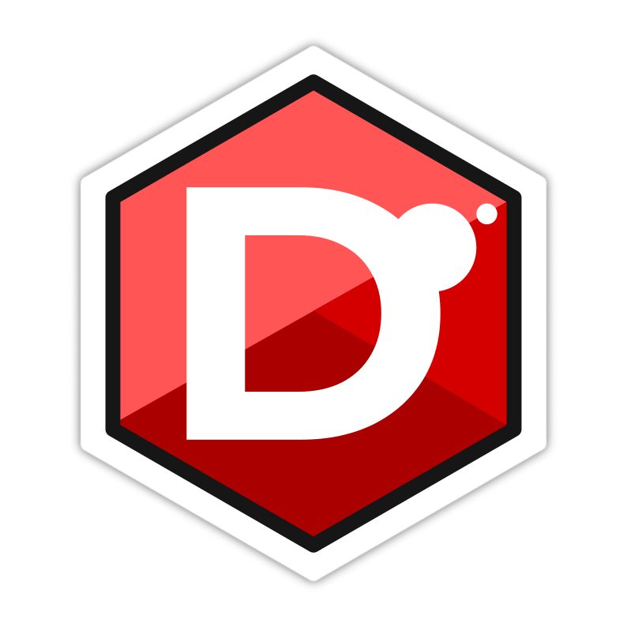

# 🏦 Bank D 

A simple banking system developed in **D (DLang)** as a learning project to explore language fundamentals, object-oriented programming, exception handling, and business rule implementation.

<p align="center">
  
</p>

---

# 🚀 What is D (DLang)?

**D** is a general-purpose programming language that combines the performance of low-level languages such as C and C++ with modern productivity features.

It provides:

* ⚡ Native code compilation
* 🧩 Object-Oriented Programming (OOP)
* 🧠 Generic Programming (Templates)
* 🔧 Metaprogramming
* 🛡️ Strong type safety
* 📦 Built-in module system
* 🚀 High performance with modern language design

D aims to deliver the efficiency of systems programming languages while reducing much of the complexity commonly associated with traditional C++ development.

---

# 💡 Why I Chose D

I enjoy working with C and C++, but I wanted to explore a language that offers similar performance while providing a more streamlined development experience.

D allows developers to build high-performance applications with features such as:

* Cleaner syntax
* Built-in module system
* Less boilerplate code
* Easier memory management options
* Modern language features out of the box

This project was created as an opportunity to learn and evaluate D in practice.

---

# 📋 Project Overview

This is a simple banking system designed for educational purposes.

### Features

* ✅ Account creation
* ✅ Account lookup
* ✅ Deposits
* ✅ Withdrawals
* ✅ Transfers between accounts
* ✅ Account number validation
* ✅ Exception handling

### Implemented Functions

* `existsNumber()` → Checks whether an account number already exists
* `getMyAccount()` → Displays account information
* `create_acc()` → Creates a new account
* `deposit()` → Deposits money into an account
* `withdraw()` → Withdraws money from an account
* `transfer()` → Transfers funds between accounts

---

# 🖥️ Example Output

```text
From: 0001 | To: 0002 | Transfer: R$ 1300 | Balance: R$ 0

Client: 0001 | Deposit: R$ 5000 | Balance: R$ 5000

From: 0001 | To: 0002 | Transfer: R$ 3100 | Balance: R$ 1900

Client: 0001 | Withdraw: R$ 120 | Balance: R$ 1780

====== Account =======
Name: Samuel
Account: 0001
Balance: R$ 1780

====== Account =======
Name: Maria Antônia R. S.
Account: 0002
Balance: R$ 4400
```

---

# ⚙️ Installation

## 1. Install DMD

### Ubuntu / Debian

```bash
sudo apt install dmd
```

### Official Installer (Cross-Platform)

```bash
curl -fsS https://dlang.org/install.sh | bash -s dmd
```

---

## 2. Activate DMD Environment

```bash
source ~/dlang/dmd-*/activate
```

---

## 3. Enable Globally (Optional)

```bash
echo 'source ~/dlang/dmd-*/activate' >> ~/.bashrc
source ~/.bashrc
```

---

# ▶️ Running the Project

Compile manually:

```bash
dmd main.d app/models/account.d app/models/user.d app/services/account_service.d
./main
```

Or use RDMD:

```bash
rdmd main.d app/models/account.d app/models/user.d app/services/account_service.d
```

---

# 📦 Using DUB (Recommended for Larger Projects)

Initialize a new project:

```bash
dub init my_project
```

Run:

```bash
dub run
```

Build:

```bash
dub build
```

---

# 📚 Learning Goals

This project was created to practice:

* Object-Oriented Programming
* Modular Architecture
* Exception Handling
* Business Rules Validation
* D Language Fundamentals
* CLI Application Development
  
---

# ⚜️ Author

**Samuel Assis**

Passionate about software development, system design, and high-performance programming.

---

# 📜 License

Released under the MIT License.

Permission is hereby granted to use, copy, modify, merge, publish, distribute, sublicense, and/or sell copies of this software, subject to the terms of the MIT License.

⚜️ Copyright (c) 2026 Samuel Assis
